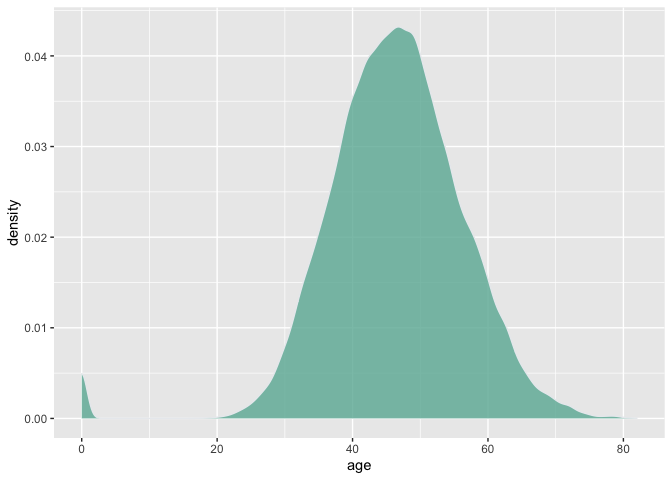
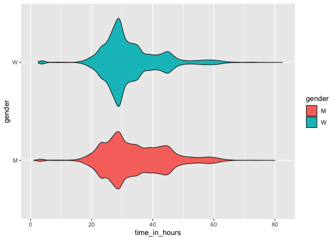
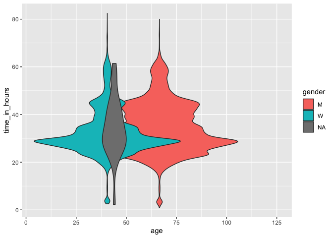
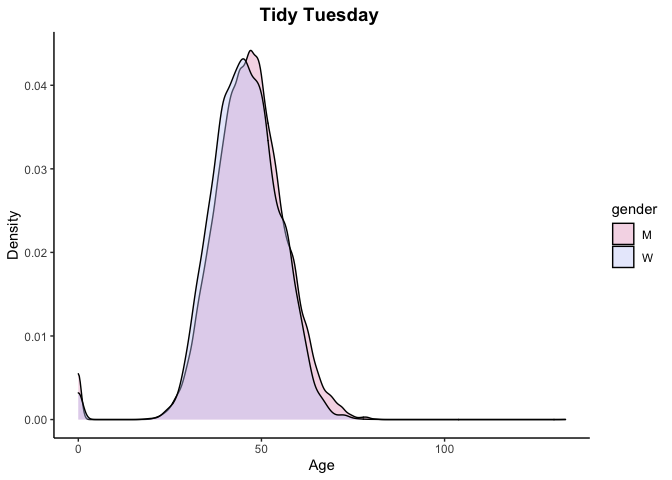

TidyTuesdays from 2021-2 class
================

The following code chunk have the essential libraries for the subsequent
code.

``` r
library(tidyverse, warn.conflicts = FALSE)
library(tidytuesdayR)

tuesdata <- tidytuesdayR::tt_load(2021, week = 44)
```

    ## 
    ##  Downloading file 1 of 2: `ultra_rankings.csv`
    ##  Downloading file 2 of 2: `race.csv`

``` r
rankings <- tuesdata$ultra_rankings
```

Estudiantes:

## Alexandra

``` r
# Make the histogram
rankings %>%
  filter( age<90 ) %>%
  ggplot( aes(x=age)) +
    geom_density(fill="#69b3a2", color="#e9ecef", alpha=0.8)
```



## Amalia

## Andrés

``` r
library(report)

rankings <-  tuesdata$ultra_rankings

rankings_modified <- rankings %>%
  mutate(time_in_hours = time_in_seconds / 3600)

  

p <- ggplot(rankings_modified, aes(x = time_in_hours, y = age))  
p + geom_point(aes(colour = factor(gender),shape =gender)) +
  labs(x='time (hr)', y = 'age' ) +
    theme(legend.position = 'down' ) +
  scale_fill_viridis_b()
```

    ## Warning: Removed 17819 rows containing missing values (geom_point).


## Manuela

``` r
library(report)

rankings <-  tuesdata$ultra_rankings

# rankings %>%
# summary() para visualizar datos
# glimpse() otra manera de visualizar los datos


# report(rankings)

 rankings_modified <- rankings %>% 
   mutate(time_in_hours = time_in_seconds / 3600) %>% 
   drop_na()
  
ggplot(rankings_modified, aes(x = time_in_hours, y = gender, fill=gender)) +
  geom_violin()
```



## Maria José

``` r
library(ggplot2)
library(dplyr)

rankings <- tuesdata$ultra_ranking

rankings_modified <-mutate(rankings, time_in_hours=time_in_seconds/3600)

ggplot(rankings_modified, aes (x=age, y=time_in_hours,fill=gender))+
  geom_violin()
```

    ## Warning: Removed 17791 rows containing non-finite values (stat_ydensity).

    ## Warning: position_dodge requires non-overlapping x intervals



## Pablo

``` r
library(tidytuesdayR)

# rankings <- tuesdata$ultra_rankings

# tuesdata$ultra_rankings

  

# Libraries..

# library(hrbrthemes)
# library(dplyr)
# library(tidyr)
# library(viridis)
# library(ggplot2)

# Make the histogram....

#rankings %>%
  #mutate(time_in_hours = time_in_seconds / 3600)


 p2 <- ggplot(data=rankings, aes(x=time_in_seconds, group=age, fill=age)) +
    geom_density(adjust=1.5, alpha=0.4) +
    theme_minimal()
 p2
```


## Susana

``` r
library(ggplot2)
library(wesanderson)
theme_set(theme_classic()) 
# head(rankings)
data_frame <- na.omit(rankings)
# head(data_frame)
p <- ggplot(data_frame, aes(x = age, fill = gender)) + 
geom_density(alpha = 0.4) + scale_fill_manual(values = wes_palette("GrandBudapest2")) +
labs(title = "Tidy Tuesday ", x = "Age", y = "Density") + theme(plot.title = element_text(size = 14, face = "bold")) + theme(plot.title = element_text(hjust = 0.5))
p
```



# References

<div id="refs" class="references csl-bib-body hanging-indent">

<div id="ref-R-rmarkdown" class="csl-entry">

Allaire, JJ, Yihui Xie, Jonathan McPherson, Javier Luraschi, Kevin
Ushey, Aron Atkins, Hadley Wickham, Joe Cheng, Winston Chang, and
Richard Iannone. 2021. *Rmarkdown: Dynamic Documents for r*.
<https://CRAN.R-project.org/package=rmarkdown>.

</div>

<div id="ref-R-tidytuesdayR" class="csl-entry">

Hughes, Ellis. 2020. *tidytuesdayR: Access the Weekly TidyTuesday
Project Dataset*. <https://github.com/thebioengineer/tidytuesdayR>.

</div>

<div id="ref-report2021" class="csl-entry">

Makowski, Dominique, Mattan S. Ben-Shachar, Indrajeet Patil, and Daniel
Lüdecke. 2021. “Automated Results Reporting as a Practical Tool to
Improve Reproducibility and Methodological Best Practices Adoption.”
*CRAN*. <https://github.com/easystats/report>.

</div>

<div id="ref-R-report" class="csl-entry">

Makowski, Dominique, Daniel Lüdecke, Mattan S. Ben-Shachar, and
Indrajeet Patil. 2021. *Report: Automated Reporting of Results and
Statistical Models*. <https://easystats.github.io/report/>.

</div>

<div id="ref-R-wesanderson" class="csl-entry">

Ram, Karthik, and Hadley Wickham. 2018. *Wesanderson: A Wes Anderson
Palette Generator*. <https://github.com/karthik/wesanderson>.

</div>

<div id="ref-R-renv" class="csl-entry">

Ushey, Kevin. 2021. *Renv: Project Environments*.
<https://rstudio.github.io/renv/>.

</div>

<div id="ref-ggplot22016" class="csl-entry">

Wickham, Hadley. 2016. *Ggplot2: Elegant Graphics for Data Analysis*.
Springer-Verlag New York. <https://ggplot2.tidyverse.org>.

</div>

<div id="ref-R-tidyverse" class="csl-entry">

———. 2021. *Tidyverse: Easily Install and Load the Tidyverse*.
<https://CRAN.R-project.org/package=tidyverse>.

</div>

<div id="ref-tidyverse2019" class="csl-entry">

Wickham, Hadley, Mara Averick, Jennifer Bryan, Winston Chang, Lucy
D’Agostino McGowan, Romain François, Garrett Grolemund, et al. 2019.
“Welcome to the <span class="nocase">tidyverse</span>.” *Journal of Open
Source Software* 4 (43): 1686. <https://doi.org/10.21105/joss.01686>.

</div>

<div id="ref-R-ggplot2" class="csl-entry">

Wickham, Hadley, Winston Chang, Lionel Henry, Thomas Lin Pedersen,
Kohske Takahashi, Claus Wilke, Kara Woo, Hiroaki Yutani, and Dewey
Dunnington. 2021. *Ggplot2: Create Elegant Data Visualisations Using the
Grammar of Graphics*. <https://CRAN.R-project.org/package=ggplot2>.

</div>

<div id="ref-R-dplyr" class="csl-entry">

Wickham, Hadley, Romain François, Lionel Henry, and Kirill Müller. 2021.
*Dplyr: A Grammar of Data Manipulation*.
<https://CRAN.R-project.org/package=dplyr>.

</div>

<div id="ref-knitr2014" class="csl-entry">

Xie, Yihui. 2014. “Knitr: A Comprehensive Tool for Reproducible Research
in R.” In *Implementing Reproducible Computational Research*, edited by
Victoria Stodden, Friedrich Leisch, and Roger D. Peng. Chapman;
Hall/CRC. <http://www.crcpress.com/product/isbn/9781466561595>.

</div>

<div id="ref-knitr2015" class="csl-entry">

———. 2015. *Dynamic Documents with R and Knitr*. 2nd ed. Boca Raton,
Florida: Chapman; Hall/CRC. <https://yihui.org/knitr/>.

</div>

<div id="ref-R-knitr" class="csl-entry">

———. 2021. *Knitr: A General-Purpose Package for Dynamic Report
Generation in r*. <https://yihui.org/knitr/>.

</div>

<div id="ref-rmarkdown2018" class="csl-entry">

Xie, Yihui, J. J. Allaire, and Garrett Grolemund. 2018. *R Markdown: The
Definitive Guide*. Boca Raton, Florida: Chapman; Hall/CRC.
<https://bookdown.org/yihui/rmarkdown>.

</div>

<div id="ref-rmarkdown2020" class="csl-entry">

Xie, Yihui, Christophe Dervieux, and Emily Riederer. 2020. *R Markdown
Cookbook*. Boca Raton, Florida: Chapman; Hall/CRC.
<https://bookdown.org/yihui/rmarkdown-cookbook>.

</div>

</div>
