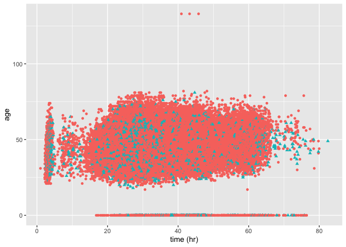
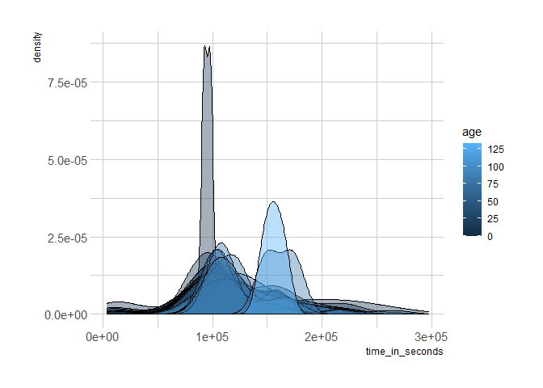

TidyTuesdays from 2021-2 class
================

The following code chunk have the essential libraries for the subsequent
code.

``` r
library(tidyverse, warn.conflicts = FALSE)
library(tidytuesdayR)

tuesdata <- tidytuesdayR::tt_load(2021, week = 44)
```

    ## 
    ##  Downloading file 1 of 2: `ultra_rankings.csv`
    ##  Downloading file 2 of 2: `race.csv`

Estudiantes:

## Alexandra

## Amalia

## Andrés

``` r
library(report)

rankings <-  tuesdata$ultra_rankings

rankings_modified <- rankings %>%
  mutate(time_in_hours = time_in_seconds / 3600)

  

p <- ggplot(rankings_modified, aes(x = time_in_hours, y = age))  
p + geom_point(aes(colour = factor(gender),shape =gender)) +
  labs(x='time (hr)', y = 'age' ) +
    theme(legend.position = 'down' ) +
  scale_fill_viridis_b()
```

    ## Warning: Removed 17819 rows containing missing values (geom_point).

<!-- -->

## Manuela

## Maria José

## Pablo

``` r
library(tidytuesdayR)
library(report)
```

    ## Warning: package 'report' was built under R version 4.1.2

``` r
rankings <- tuesdata$ultra_rankings

tuesdata$ultra_rankings
```

    ## # A tibble: 137,803 x 8
    ##    race_year_id  rank runner     time     age gender nationality time_in_seconds
    ##           <dbl> <dbl> <chr>      <chr>  <dbl> <chr>  <chr>                 <dbl>
    ##  1        68140     1 VERHEUL J~ 26H 3~    30 M      GBR                   95725
    ##  2        68140     2 MOULDING ~ 27H 0~    43 M      GBR                   97229
    ##  3        68140     3 RICHARDSO~ 28H 4~    38 M      GBR                  103747
    ##  4        68140     4 DYSON Fio~ 30H 5~    55 W      GBR                  111217
    ##  5        68140     5 FRONTERAS~ 32H 4~    48 W      GBR                  117981
    ##  6        68140     6 THOMAS Le~ 32H 4~    31 M      GBR                  118000
    ##  7        68140     7 SHORT Deb~ 33H 3~    55 W      GBR                  120601
    ##  8        68140     8 CROSSLEY ~ 33H 3~    40 W      GBR                  120803
    ##  9        68140     9 BUTCHER K~ 34H 5~    47 M      GBR                  125656
    ## 10        68140    10 Hendry Bi~ 34H 5~    29 M      GBR                  125979
    ## # ... with 137,793 more rows

``` r
# Libraries..

library(hrbrthemes)
```

    ## Warning: package 'hrbrthemes' was built under R version 4.1.2

    ## NOTE: Either Arial Narrow or Roboto Condensed fonts are required to use these themes.

    ##       Please use hrbrthemes::import_roboto_condensed() to install Roboto Condensed and

    ##       if Arial Narrow is not on your system, please see https://bit.ly/arialnarrow

``` r
library(dplyr)
library(tidyr)
library(viridis)
```

    ## Warning: package 'viridis' was built under R version 4.1.2

    ## Loading required package: viridisLite

    ## Warning: package 'viridisLite' was built under R version 4.1.1

``` r
library(ggplot2)

# Make the histogram....

#rankings %>%
  #mutate(time_in_hours = time_in_seconds / 3600)


 p2 <- ggplot(data=rankings, aes(x=time_in_seconds, group=age, fill=age)) +
    geom_density(adjust=1.5, alpha=0.4) +
    theme_ipsum()
 p2
```

    ## Warning: Removed 17791 rows containing non-finite values (stat_density).

    ## Warning in grid.Call(C_stringMetric, as.graphicsAnnot(x$label)): font family not
    ## found in Windows font database

    ## Warning in grid.Call(C_stringMetric, as.graphicsAnnot(x$label)): font family not
    ## found in Windows font database

    ## Warning in grid.Call(C_textBounds, as.graphicsAnnot(x$label), x$x, x$y, : font
    ## family not found in Windows font database

    ## Warning in grid.Call(C_stringMetric, as.graphicsAnnot(x$label)): font family not
    ## found in Windows font database

    ## Warning in grid.Call(C_textBounds, as.graphicsAnnot(x$label), x$x, x$y, : font
    ## family not found in Windows font database

    ## Warning in grid.Call(C_textBounds, as.graphicsAnnot(x$label), x$x, x$y, : font
    ## family not found in Windows font database

    ## Warning in grid.Call(C_textBounds, as.graphicsAnnot(x$label), x$x, x$y, : font
    ## family not found in Windows font database

    ## Warning in grid.Call(C_textBounds, as.graphicsAnnot(x$label), x$x, x$y, : font
    ## family not found in Windows font database

    ## Warning in grid.Call(C_textBounds, as.graphicsAnnot(x$label), x$x, x$y, : font
    ## family not found in Windows font database

    ## Warning in grid.Call(C_textBounds, as.graphicsAnnot(x$label), x$x, x$y, : font
    ## family not found in Windows font database

    ## Warning in grid.Call.graphics(C_text, as.graphicsAnnot(x$label), x$x, x$y, :
    ## font family not found in Windows font database

    ## Warning in grid.Call(C_textBounds, as.graphicsAnnot(x$label), x$x, x$y, : font
    ## family not found in Windows font database

    ## Warning in grid.Call(C_textBounds, as.graphicsAnnot(x$label), x$x, x$y, : font
    ## family not found in Windows font database

<!-- -->

## Susana

# References

<div id="refs" class="references csl-bib-body hanging-indent">

<div id="ref-R-rmarkdown" class="csl-entry">

Allaire, JJ, Yihui Xie, Jonathan McPherson, Javier Luraschi, Kevin
Ushey, Aron Atkins, Hadley Wickham, Joe Cheng, Winston Chang, and
Richard Iannone. 2021. *Rmarkdown: Dynamic Documents for r*.
<https://CRAN.R-project.org/package=rmarkdown>.

</div>

<div id="ref-R-viridis" class="csl-entry">

Garnier, Simon. 2021. *Viridis: Colorblind-Friendly Color Maps for r*.
<https://CRAN.R-project.org/package=viridis>.

</div>

<div id="ref-R-tidytuesdayR" class="csl-entry">

Hughes, Ellis. 2020. *tidytuesdayR: Access the Weekly TidyTuesday
Project Dataset*. <https://github.com/thebioengineer/tidytuesdayR>.

</div>

<div id="ref-report2021" class="csl-entry">

Makowski, Dominique, Mattan S. Ben-Shachar, Indrajeet Patil, and Daniel
Lüdecke. 2021. “Automated Results Reporting as a Practical Tool to
Improve Reproducibility and Methodological Best Practices Adoption.”
*CRAN*. <https://github.com/easystats/report>.

</div>

<div id="ref-R-report" class="csl-entry">

Makowski, Dominique, Daniel Lüdecke, Mattan S. Ben-Shachar, and
Indrajeet Patil. 2021. *Report: Automated Reporting of Results and
Statistical Models*. <https://easystats.github.io/report/>.

</div>

<div id="ref-R-hrbrthemes" class="csl-entry">

Rudis, Bob. 2020. *Hrbrthemes: Additional Themes, Theme Components and
Utilities for Ggplot2*. <http://github.com/hrbrmstr/hrbrthemes>.

</div>

<div id="ref-R-renv" class="csl-entry">

Ushey, Kevin. 2021. *Renv: Project Environments*.
<https://rstudio.github.io/renv/>.

</div>

<div id="ref-ggplot22016" class="csl-entry">

Wickham, Hadley. 2016. *Ggplot2: Elegant Graphics for Data Analysis*.
Springer-Verlag New York. <https://ggplot2.tidyverse.org>.

</div>

<div id="ref-R-tidyr" class="csl-entry">

———. 2021a. *Tidyr: Tidy Messy Data*.
<https://CRAN.R-project.org/package=tidyr>.

</div>

<div id="ref-R-tidyverse" class="csl-entry">

———. 2021b. *Tidyverse: Easily Install and Load the Tidyverse*.
<https://CRAN.R-project.org/package=tidyverse>.

</div>

<div id="ref-tidyverse2019" class="csl-entry">

Wickham, Hadley, Mara Averick, Jennifer Bryan, Winston Chang, Lucy
D’Agostino McGowan, Romain François, Garrett Grolemund, et al. 2019.
“Welcome to the <span class="nocase">tidyverse</span>.” *Journal of Open
Source Software* 4 (43): 1686. <https://doi.org/10.21105/joss.01686>.

</div>

<div id="ref-R-ggplot2" class="csl-entry">

Wickham, Hadley, Winston Chang, Lionel Henry, Thomas Lin Pedersen,
Kohske Takahashi, Claus Wilke, Kara Woo, Hiroaki Yutani, and Dewey
Dunnington. 2021. *Ggplot2: Create Elegant Data Visualisations Using the
Grammar of Graphics*. <https://CRAN.R-project.org/package=ggplot2>.

</div>

<div id="ref-R-dplyr" class="csl-entry">

Wickham, Hadley, Romain François, Lionel Henry, and Kirill Müller. 2021.
*Dplyr: A Grammar of Data Manipulation*.
<https://CRAN.R-project.org/package=dplyr>.

</div>

<div id="ref-knitr2014" class="csl-entry">

Xie, Yihui. 2014. “Knitr: A Comprehensive Tool for Reproducible Research
in R.” In *Implementing Reproducible Computational Research*, edited by
Victoria Stodden, Friedrich Leisch, and Roger D. Peng. Chapman;
Hall/CRC. <http://www.crcpress.com/product/isbn/9781466561595>.

</div>

<div id="ref-knitr2015" class="csl-entry">

———. 2015. *Dynamic Documents with R and Knitr*. 2nd ed. Boca Raton,
Florida: Chapman; Hall/CRC. <https://yihui.org/knitr/>.

</div>

<div id="ref-R-knitr" class="csl-entry">

———. 2021. *Knitr: A General-Purpose Package for Dynamic Report
Generation in r*. <https://yihui.org/knitr/>.

</div>

<div id="ref-rmarkdown2018" class="csl-entry">

Xie, Yihui, J. J. Allaire, and Garrett Grolemund. 2018. *R Markdown: The
Definitive Guide*. Boca Raton, Florida: Chapman; Hall/CRC.
<https://bookdown.org/yihui/rmarkdown>.

</div>

<div id="ref-rmarkdown2020" class="csl-entry">

Xie, Yihui, Christophe Dervieux, and Emily Riederer. 2020. *R Markdown
Cookbook*. Boca Raton, Florida: Chapman; Hall/CRC.
<https://bookdown.org/yihui/rmarkdown-cookbook>.

</div>

</div>
