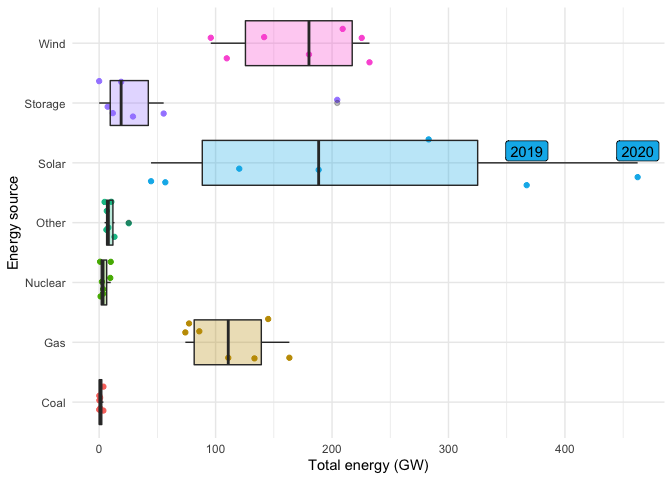

TidyTuesdays from 2022-2 class
================

The following code chunk have the essential libraries for the subsequent
code.

``` r
library(tidyverse, warn.conflicts = FALSE)
library(tidytuesdayR)

tuesdata <- tidytuesdayR::tt_load(2022, week = 18)
```

    ## 
    ##  Downloading file 1 of 4: `capacity.csv`
    ##  Downloading file 2 of 4: `wind.csv`
    ##  Downloading file 3 of 4: `solar.csv`
    ##  Downloading file 4 of 4: `average_cost.csv`

``` r
power_capacity <-  tuesdata$capacity
```

``` r
ggplot(power_capacity, aes(y = type, x = total_gw, fill = type)) +
  geom_jitter(aes(color = type)) +
  geom_boxplot(alpha = 0.3) +
  theme_minimal() +
  theme(
    legend.position = "none"
  ) +
  labs(
    x = "Total energy (GW)",
    y = "Energy source"
  ) +
  geom_label(data = filter(power_capacity, total_gw > 300), aes(label = year), nudge_x = 0.1, nudge_y = 0.2)
```



Estudiantes:

## Sara

``` r
#Write below here
```

## JJ. Botero

``` r
#Write below here
```

## Estefania

``` r
# Write below here
```

## Eduardo

``` r
# Write below here
```

## Juan Andres

``` r
# Write below here
```

## Juan Manuel

``` r
# Write below here
```

## Melissa

``` r
# Write below here
```

## Sebastian

``` r
# Write below here
```

## JJ. Picon

``` r
# Write below here
```

## Alejandro

``` r
# Write below here
```

## Federico

``` r
# Write below here
```

## Camila

``` r
# Write below here
```

## Vanessa

``` r
# Write below here
```

# References

<div id="refs" class="references csl-bib-body hanging-indent">

<div id="ref-R-rmarkdown" class="csl-entry">

Allaire, JJ, Yihui Xie, Jonathan McPherson, Javier Luraschi, Kevin
Ushey, Aron Atkins, Hadley Wickham, Joe Cheng, Winston Chang, and
Richard Iannone. 2022. *Rmarkdown: Dynamic Documents for r*.
<https://CRAN.R-project.org/package=rmarkdown>.

</div>

<div id="ref-R-tidytuesdayR" class="csl-entry">

Hughes, Ellis. 2022. *tidytuesdayR: Access the Weekly TidyTuesday
Project Dataset*. <https://github.com/thebioengineer/tidytuesdayR>.

</div>

<div id="ref-R-renv" class="csl-entry">

Ushey, Kevin. 2021. *Renv: Project Environments*.
<https://rstudio.github.io/renv/>.

</div>

<div id="ref-R-tidyverse" class="csl-entry">

Wickham, Hadley. 2021. *Tidyverse: Easily Install and Load the
Tidyverse*. <https://CRAN.R-project.org/package=tidyverse>.

</div>

<div id="ref-tidyverse2019" class="csl-entry">

Wickham, Hadley, Mara Averick, Jennifer Bryan, Winston Chang, Lucy
D’Agostino McGowan, Romain François, Garrett Grolemund, et al. 2019.
“Welcome to the <span class="nocase">tidyverse</span>.” *Journal of Open
Source Software* 4 (43): 1686. <https://doi.org/10.21105/joss.01686>.

</div>

<div id="ref-knitr2014" class="csl-entry">

Xie, Yihui. 2014. “Knitr: A Comprehensive Tool for Reproducible Research
in R.” In *Implementing Reproducible Computational Research*, edited by
Victoria Stodden, Friedrich Leisch, and Roger D. Peng. Chapman;
Hall/CRC. <http://www.crcpress.com/product/isbn/9781466561595>.

</div>

<div id="ref-knitr2015" class="csl-entry">

———. 2015. *Dynamic Documents with R and Knitr*. 2nd ed. Boca Raton,
Florida: Chapman; Hall/CRC. <https://yihui.org/knitr/>.

</div>

<div id="ref-R-knitr" class="csl-entry">

———. 2022. *Knitr: A General-Purpose Package for Dynamic Report
Generation in r*. <https://yihui.org/knitr/>.

</div>

<div id="ref-rmarkdown2018" class="csl-entry">

Xie, Yihui, J. J. Allaire, and Garrett Grolemund. 2018. *R Markdown: The
Definitive Guide*. Boca Raton, Florida: Chapman; Hall/CRC.
<https://bookdown.org/yihui/rmarkdown>.

</div>

<div id="ref-rmarkdown2020" class="csl-entry">

Xie, Yihui, Christophe Dervieux, and Emily Riederer. 2020. *R Markdown
Cookbook*. Boca Raton, Florida: Chapman; Hall/CRC.
<https://bookdown.org/yihui/rmarkdown-cookbook>.

</div>

</div>
